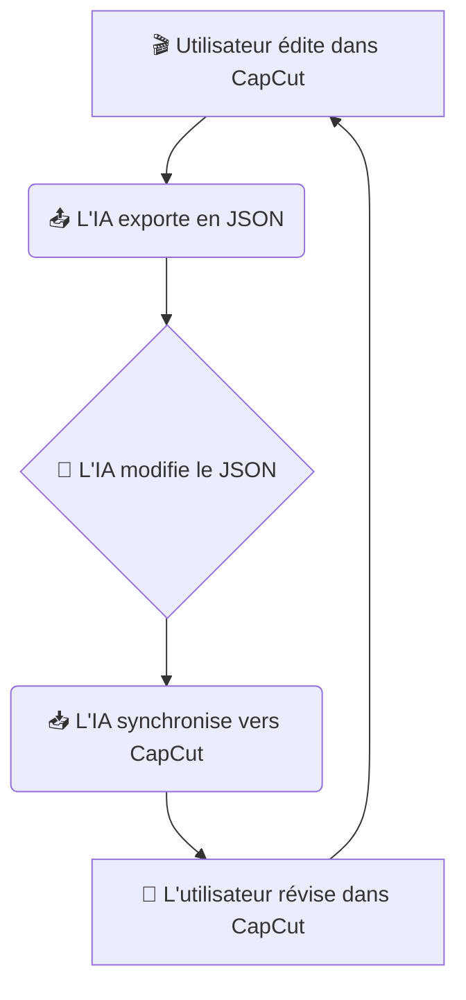

# 🧞 CapGenie: Votre Assistant IA pour le Montage Vidéo sur CapCut

<!-- Badges -->
<div align="center">
    <!-- PyPI Version -->
    <a href="https://pypi.org/project/capgenie/"></a>
    <!-- GitHub Actions CI/CD Status -->
    <a href="https://github.com/your-username/capgenie/actions"></a>
    <!-- License -->
    <a href="LICENSE"></a>
    <!-- Python Versions -->
    <a href="https://pypi.org/project/capgenie/"></a>
</div>

<br>

**CapGenie est une bibliothèque Python qui permet aux agents IA d'éditer des projets vidéo CapCut de manière programmatique, tout en vous laissant le contrôle total pour la touche finale.**

## 🤔 Pourquoi CapGenie ?

L'idée est simple : déléguer les tâches de montage répétitives ou complexes à une IA, tout en gardant la main sur la direction artistique. CapGenie fait le pont entre la puissance de l'automatisation par le code et l'intuitivité de l'interface de CapCut.

## ✨ Fonctionnalités

*   🤖 **Édition par l'IA** : Manipulez la timeline de vos projets CapCut via une structure JSON simplifiée.
*   🧑‍💻 **Contrôle Utilisateur** : Révisez et ajustez les modifications de l'IA directement dans CapCut. Vous restez le réalisateur.
*   🔄 **Synchronisation Fluide** :
    *   `export_to_json()`: Extrait l'état d'un projet CapCut vers un fichier JSON simple.
    *   `sync_from_json()`: Applique les changements du fichier JSON vers le projet CapCut.

## 🚀 Installation

Installez CapGenie en une seule commande :

```bash
pip install capgenie
```

## ▶️ Démarrage Rapide

Voici un exemple minimal pour modifier un projet existant.

```python
import json
from capgenie import Project

# --- 1. Configuration ---
# Le chemin vers votre projet CapCut
capcut_project_path = r'C:\Users\YourUser\AppData\Local\CapCut\User Data\Projects\com.lveditor.draft\YOUR_PROJECT_ID'
# Le fichier JSON que l'IA va manipuler
ai_json_path = 'my_video_for_ai.json'

# --- 2. Initialisation ---
project = Project(project_path=capcut_project_path)

# --- 3. Export pour l'IA ---
project.export_to_json(ai_json_path)
print(f"✅ Projet exporté vers {ai_json_path}")

# --- 4. L'IA modifie le JSON (par exemple, ajoute un clip) ---
with open(ai_json_path, 'r+') as f:
    data = json.load(f)
    # Ajoute une nouvelle séquence vidéo à la fin
    new_clip = {
      "path": "test_video/new_clip.mp4", # Assurez-vous que le média existe
      "start_time": data['sequences'][-1]['end_time'] if data.get('sequences') else 0.0,
      "end_time": (data['sequences'][-1]['end_time'] if data.get('sequences') else 0.0) + 5.0, # Durée de 5s
      "source_in": 0.0, "source_out": 5.0, "type": "video", "track_index": 0
    }
    data.setdefault('sequences', []).append(new_clip)
    f.seek(0)
    json.dump(data, f, indent=2)
    f.truncate()
print("🤖 L'IA a ajouté un nouveau clip.")

# --- 5. Synchronisation vers CapCut ---
project.sync_from_json(ai_json_path)
print("🎉 Synchronisation terminée ! Ouvrez CapCut pour voir le résultat.")
```

## ⚙️ Configuration

Pour que CapGenie fonctionne, assurez-vous que :

1.  **CapCut est installé** sur votre machine.
2.  Les **chemins d'accès aux médias** (`path` dans le JSON) sont corrects et accessibles depuis l'environnement où le script est exécuté. Ils peuvent être relatifs ou absolus.

## 🔄 Cycle de Collaboration : Le Workflow

Le processus est un cycle itératif simple et puissant :



## 📚 Référence du Modèle JSON

Le fichier JSON manipulé par l'IA est une représentation simplifiée de la timeline. Voici la documentation complète de tous les paramètres disponibles pour chaque séquence :

### Structure de base

```json
{
  "sequences": [
    {
      "path": "chemin/vers/votre/media.mp4",
      "start_time": 0.0,
      "end_time": 5.0,
      "source_in": 0.0,
      "source_out": 5.0,
      "type": "video",
      "track_index": 0,
      "volume": 1.0,
      "fade_in_duration": 0.5,
      "fade_out_duration": 0.5
    }
  ]
}
```

### Détail des paramètres

#### Paramètres principaux
- `path` (string, requis) : 
  - Chemin absolu vers le fichier média (vidéo ou audio). Doit être accessible depuis le système de fichiers.
  
- `start_time` (float, requis) :
  - Position de départ sur la timeline, en secondes.
  - Exemple : `0.0` pour commencer au début de la vidéo.

- `end_time` (float, requis) :
  - Position de fin sur la timeline, en secondes.
  - La durée de la séquence est calculée comme `end_time - start_time`.

- `source_in` (float, optionnel, défaut: 0.0) :
  - Point de départ dans le média source, en secondes (découpage temporel).
  - Permet de ne prendre qu'une partie du média source.

- `source_out` (float, optionnel) :
  - Point de fin dans le média source, en secondes (découpage temporel).
  - Si non spécifié, utilise toute la durée disponible après `source_in`.

- `type` (string, requis) :
  - Type de média : `"video"` ou `"audio"`.
  - Détermine comment le média est traité dans la timeline.

- `track_index` (integer, optionnel, défaut: 0) :
  - Piste sur laquelle placer la séquence.
  - **Convention recommandée** :
    - Piste 0 : Vidéo
    - Piste 1 : Musique de fond
    - Piste 2 : Voix des personnages
    - Piste 3 : Voix off/narrateur

#### Effets sonores et visuels

- `volume` (float, optionnel, défaut: 1.0) :
  - Niveau de volume du média, de 0.0 (silence) à 1.0 (volume maximal).
  - Exemple : `0.7` pour 70% du volume.

- `fade_in_duration` (float, optionnel, défaut: 0.0) :
  - Durée du fondu d'entrée en secondes.
  - Pendant cette durée, le média passe progressivement du silence/transparence au volume/niveau d'opacité défini.
  - Exemple : `0.5` pour un fondu de 500ms.

- `fade_out_duration` (float, optionnel, défaut: 0.0) :
  - Durée du fondu de sortie en secondes.
  - Pendant cette durée, le média passe progressivement du volume/niveau d'opacité défini au silence/transparence.
  - Exemple : `1.0` pour un fondu de 1 seconde.

### Recommandations pour les effets de fondu

#### Durées typiques selon la longueur de la séquence :

- **Séquence courte** (< 10 secondes) :
  - Vidéo : max 0.5s (pour éviter un effet excessif)
  - Audio : 0.3–1s selon l'effet souhaité

- **Séquence moyenne** (10–30 secondes) :
  - Vidéo : 0.5–1s
  - Audio : 1–3s

- **Séquence longue** (> 30 secondes) :
  - Vidéo : 1–2s pour un effet plus doux
  - Audio : 2–5s ou plus pour l'ambiance ou la musique de fond

### Exemple avancé

```json
{
  "sequences": [
    {
      "path": "C:/Videos/intro.mp4",
      "start_time": 0.0,
      "end_time": 10.0,
      "source_in": 2.0,
      "source_out": 12.0,
      "type": "video",
      "track_index": 0,
      "fade_in_duration": 1.0,
      "fade_out_duration": 1.0,
      "volume": 0.8
    },
    {
      "path": "C:/Musique/background.mp3",
      "start_time": 0.0,
      "end_time": 30.0,
      "type": "audio",
      "track_index": 1,
      "fade_in_duration": 3.0,
      "fade_out_duration": 5.0,
      "volume": 0.6
    }
  ]
}
```

## 🤝 Contribuer

Les contributions sont les bienvenues ! N'hésitez pas à ouvrir une issue ou une pull request pour améliorer CapGenie.

## 📜 Licence

Ce projet est sous licence MIT.
