# 🧞 CapGenie: Your AI Video Editing Sidekick for CapCut 🎬

✨ CapGenie is a Python library designed to empower **AI agents** to perform video editing tasks within **CapCut projects**. It facilitates a collaborative workflow where an AI can programmatically modify video projects, and the **user retains full control** to review, refine, and correct these changes directly within the familiar CapCut interface.

The core idea is to leverage AI for automating repetitive or complex editing tasks, while ensuring the user can easily guide and finalize the output. Let the magic begin! 🪄

## 🌟 Key Features

*   🤖 **AI-Driven Edits**: Allows AI agents to manipulate CapCut projects by editing a simplified JSON representation of the video timeline.
*   🧑‍💻 **User Control & Review**: Users can seamlessly review and adjust AI-generated edits using the standard CapCut application. You're always in the director's chair!
*   🔄 **Smooth Synchronization**: Provides robust two-way synchronization:
    *   `export_to_json(simplified_json_path)`: Exports the current state of a CapCut project to a user-friendly, AI-editable JSON file.
    *   `sync_from_json(simplified_json_path)`: Applies changes from a modified simplified JSON file back to the CapCut project.

## 🚀 Workflow: AI Agent & User Collaboration Cycle

CapGenie enables a powerful and fun iterative workflow:

1.  🎬 **User Initiates/Edits in CapCut**: Start your masterpiece or make initial edits in CapCut.
2.  📤 **AI Fetches Project State**: The AI agent uses CapGenie's `export_to_json()` to get the current CapCut project timeline as a simplified JSON file.
3.  🤖 **AI Modifies JSON**: The AI agent programmatically alters this simplified JSON (e.g., adding new video clips, changing timings, adjusting properties).
4.  📥 **AI Applies Changes**: The AI agent uses CapGenie's `sync_from_json()` to apply the modifications back to the CapCut project.
5.  👀 **User Reviews in CapCut**: Open the project in CapCut to review the AI's creative work, make any tweaks, or add your final polish.
6.  🔁 **Repeat & Refine**: This cycle can be repeated as needed, allowing for continuous improvement and collaboration!

```mermaid
graph TD
    A[🎬 User Edits in CapCut] --> B(📤 AI: Exports to JSON);
    B --> C{🤖 AI Modifies JSON Data};
    C --> D(📥 AI: Syncs JSON to CapCut);
    D --> E[👀 User Reviews in CapCut];
    E --> A;
```



## 📄 Simplified JSON Structure: The AI's Playground

CapGenie works with a simplified JSON structure representing the video sequences. This file (e.g., `my_project_for_ai.json`) is what the AI agent interacts with. It's designed to be easy to understand and manipulate.

Here's a peek:

```json
{
  "sequences": [
    {
      "path": "test_video/test_vid_1.mp4",
      "start_time": 0.0,
      "end_time": 4.5,
      "source_in": 0.0,
      "source_out": 4.5,
      // ... other properties like fades, volume ...
      "type": "video",
      "track_index": 0
    },
    {
      "path": "test_video/test_vid_2.mp4",
      "start_time": 4.5,
      "end_time": 9.0,
      // ... and so on ...
    }
  ]
}
```
*(**💡 Important Tip**: Ensure video paths in the JSON are correct and accessible by CapCut. These are typically relative to your project's media folder or can be absolute paths.)*

## 🛠️ How to Use with an AI Agent (Example Workflow)

Let's see a conceptual Python example of an AI agent using CapGenie:

```python
import json
from capgenie import Project # Make sure Project is correctly importable

# --- Configuration ---
# Path to the actual CapCut project directory
capcut_project_root_path = r'C:\Users\YourUser\AppData\Local\CapCut\User Data\Projects\com.lveditor.draft\YOUR_PROJECT_ID_FOLDER'

# Path to the simplified JSON file for AI interaction
ai_editable_json_path = r'projects/my_video_for_ai.json' # Example path

# --- 1️⃣ Step 1: Initialize Project Object ---
project = Project(
    project_path=capcut_project_root_path,
    create=False # We're working with an existing project
)
print(f"✅ Project object initialized for: {capcut_project_root_path}")

# --- 2️⃣ Step 2: AI Agent - Get Current State from CapCut ---
project.export_to_json(ai_editable_json_path)
print(f"📤 Project state exported to {ai_editable_json_path}")

# --- 3️⃣ Step 3: AI Agent - Modify the Simplified JSON ---
# Example: AI adds a new video sequence
with open(ai_editable_json_path, 'r+') as f:
    data = json.load(f)
    new_sequence = {
      "path": "test_video/new_clip.mp4", # Ensure media exists!
      "start_time": data['sequences'][-1]['end_time'] if data['sequences'] else 0.0,
      "end_time": (data['sequences'][-1]['end_time'] if data['sequences'] else 0.0) + 4.0,
      "source_in": 0.0, "source_out": 4.0,
      "fade_in_duration": 0.5, "fade_out_duration": 0.5,
      "volume": 1.0, "type": "video", "track_index": 0
    }
    data['sequences'].append(new_sequence)
    f.seek(0) # Rewind to overwrite
    json.dump(data, f, indent=2)
    f.truncate()
print(f"🤖 AI agent modified {ai_editable_json_path} and added a new sequence.")

# --- 4️⃣ Step 4: AI Agent - Synchronize Changes back to CapCut ---
project.sync_from_json(ai_editable_json_path)
print(f"📥 Changes from {ai_editable_json_path} synchronized back to CapCut project.")

# --- 5️⃣ Step 5: User - Check Changes in CapCut ---
print("\n🎉 Workflow complete! Please open your project in CapCut to see the AI's magic.")

```

## 📦 Installation

Get CapGenie up and running with pip:

```bash
pip install capgenie
```
*(📢 Note: Update with the correct package name if different once published to PyPI.)*

## 🤝 Contributing

Got ideas to make CapGenie even better? Contributions are welcome! 🤗
Please feel free to submit issues or pull requests.

## 📜 License

CapGenie is released under the MIT License.
